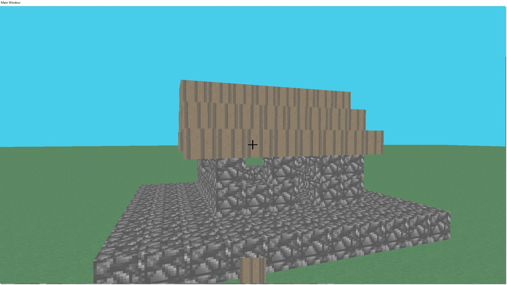

# Hexaface

A game coded in C that uses the Vulkan API and
[stb_image](https://github.com/nothings/stb).



This is just a project I did to learn how to make a 3D game with the Vulkan
API, the C language and as few libraries as possible.

I give you the instructions that I use to bulid and run the game. I only try this
on my computer so it may not work on yours.

**The game only works on Windows!**

# Building

Install [cmake](https://cmake.org/download/), and
[MSYS2](https://www.msys2.org/) with MinGW.

Use a command like ```cmake -B build -G "MinGW Makefiles" -DCMAKE_BUILD_TYPE=Release```
to configure cmake.  
Then run something like ```cmake --build build```.

# Running

You just need the hexaface.exe executable and the appdata folder to run the
game. However, you also need to create a folder in the appdata folder named
```world``` that will later store the world. (I did not find yet how to create
an empty directory)

By default, the working directory must be the one that contains the appdata folder.  
If you follow the building instructions. You should just have to run
```./build/hexaface.exe``` to start the game.

# Launch options

```--width number``` Set the width of the window

```--height number``` Set the height of the window

```--appadata appdataFolder``` Tell the path to the appdata folder that
contains the game data

## Examples

```./hexaface.exe --width 1920 --height 1080``` lauch the game in a window with
a size of 1920 by 1080

```./hexaface --appdata "../appdata"``` Tell the game that the appdata folder
is in the parent directory

# Keybinds

- Arrow keys to move the camera,
- WQSD to move forward/backward and left/right,
- Shift and Space to move up or down,
- Q to place a block, E to destroy it,
- Z and C to switch the block in your hand

# Features

- Infinite flat world generation,
- 16 blocks world height,
- World saving,
- Command line options to change the window width/height,
- Command line options to change the path of the appdata folder,
- Controls only on keyboard,
- hold the place/destroy key to continuously place/destroy blocks,
- Blocks of grass, dirt, stone and planks